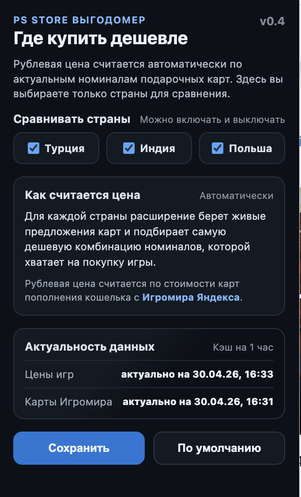
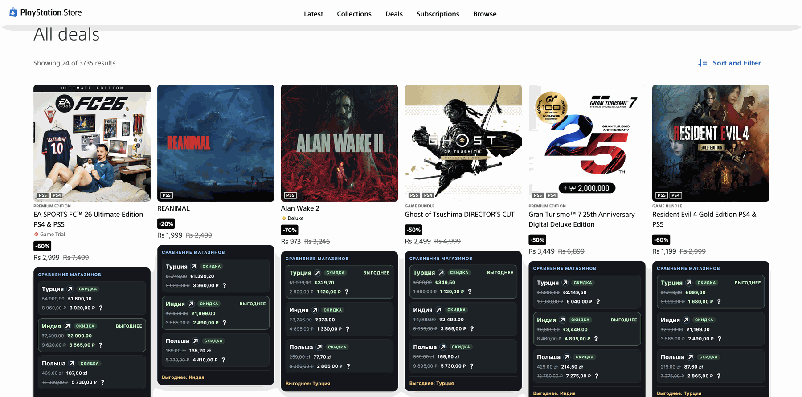
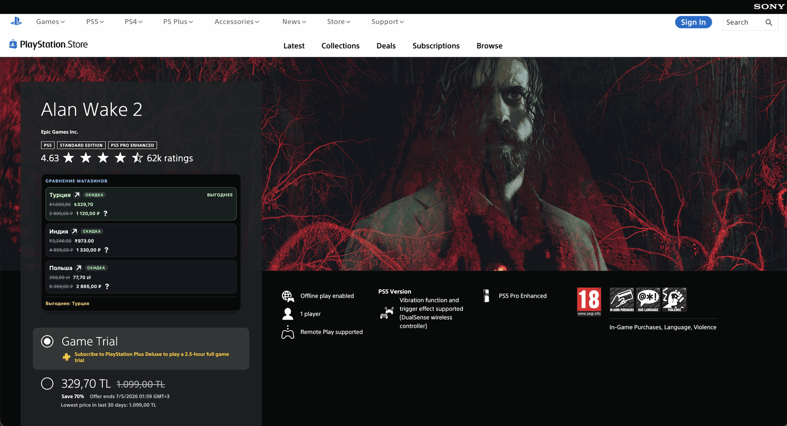

# PS Store Выгодомер

Chrome-расширение для `store.playstation.com`, которое показывает под карточками игр сравнение цен в разных региональных PS Store.

## Статус проекта

Проект неофициальный и не связан с Sony Interactive Entertainment. Расширение не одобрено и не поддерживается Sony Interactive Entertainment.

## Что делает

- сравнивает цены игры в Турции, Индии и Польше
- показывает полную цену и текущую цену со скидкой, если скидка есть
- пересчитывает каждую цену в рубли по стоимости карт пополнения кошелька
- берет номиналы карт из API Игромира Яндекса
- подбирает самую дешевую комбинацию карт, которой хватает на покупку
- позволяет выбрать страны для сравнения в попапе расширения
- кэширует цены и номиналы на 1 час, чтобы меньше дергать PS Store и Игромир

## Скриншоты

### Настройки

### Сравнение на странице каталога

### Сравнение на странице игры

## Как считается цена в рублях

Для каждой выбранной страны расширение получает список карт пополнения: у карты есть цена в рублях и номинал в валюте магазина. Затем фоновый скрипт подбирает самую дешевую корзину карт, покрывающую цену игры.

Подсказка рядом с рублевой ценой показывает состав корзины, остаток на кошельке и эффективный курс покупки.

## Установка

1. Откройте `chrome://extensions`
2. Включите `Developer mode`
3. Нажмите `Load unpacked`
4. Выберите эту папку
5. Откройте попап расширения и выберите страны для сравнения

## Приватность и хранение данных

Расширение работает без отдельного сервера: все расчеты выполняются в браузере пользователя, а кэш цен и номиналов хранится локально в браузере. Данные пользователя никуда не передаются.

## Примечания

- Если игра недоступна в конкретном регионе, строка покажет `Недоступно`.
- Из-за большого числа запросов Sony может временно ограничивать доступ к PS Store по IP. В таком случае расширение делает паузу перед новыми запросами.
- Парсер зависит от текущей разметки PS Store, поэтому при изменениях со стороны Sony может понадобиться обновление.
